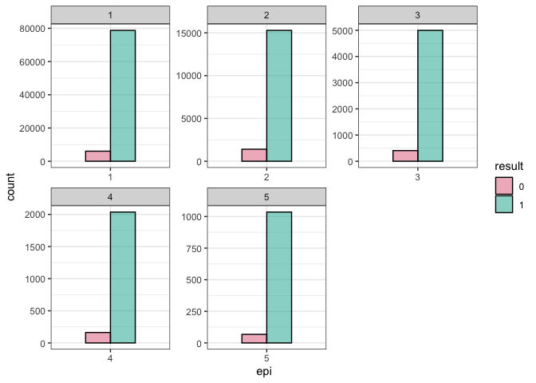

Sepsis Survival Classification Naives Bayes
================
Rex Manglicmot
2022-12-18

-   <a href="#status-continuing-working-document"
    id="toc-status-continuing-working-document">Status: Continuing Working
    Document</a>
-   <a href="#introduction" id="toc-introduction">Introduction</a>
-   <a href="#loading-the-libraries" id="toc-loading-the-libraries">Loading
    the Libraries</a>
-   <a href="#loading-the-data" id="toc-loading-the-data">Loading the
    Data</a>
-   <a href="#cleaning-the-data" id="toc-cleaning-the-data">Cleaning the
    Data</a>
-   <a href="#exploratory-data-analysis"
    id="toc-exploratory-data-analysis">Exploratory Data Analysis</a>
-   <a href="#naives-bayes" id="toc-naives-bayes">Naives Bayes</a>
    -   <a href="#pros" id="toc-pros">Pros</a>
    -   <a href="#cons" id="toc-cons">Cons</a>
-   <a href="#limitations" id="toc-limitations">Limitations</a>
-   <a href="#conclusion" id="toc-conclusion">Conclusion</a>
-   <a href="#inspiration-for-this-project"
    id="toc-inspiration-for-this-project">Inspiration for this project</a>

## Status: Continuing Working Document

Things still need to do/Questions:

-   Concepts on Naive Bayes + Cite Sources
-   color section for histogram
-   think of new ideas to display plots

## Introduction

<center>


</center>

**?????** According to the Center for Disease Control and Prevention, in
a given year, 1 of 3 patients who have died within the hospital had
sepsis during hospitalization, however, nearly 87% of sepsis cases
starts before the patient goes to the hospital.[^1] It leaves hospitals
institutions in a precarious situation. How do ultimately help a patient
get better and not be subjected to malpractice suits?

The dataset contains 4 clinical features as follows:

-   age(int): years: integer
-   sex(binary): 0=male and 1=female
-   episode_number (int):
-   hospital_outcome(boolean): 0=dead and 1=alive

## Loading the Libraries

``` r
#install.packages('hrbrthemes') #installed on 12/18/22
#install.packages('ggthemes') #installed on 12/18/22
#install.packages('ggdark') #installed on 12/8/22
#install.packages('colorspace') #installed on 12/8/22

library(tidyverse)
library(ggthemes)
library(ggplot2)
library(viridis)
library(colorspace)
library(scales)
```

## Loading the Data

``` r
#load the data
data_orig <- read.csv('Sepsis Survival.csv')

#view first 7 rows
head(data_orig, 7)
```

    ##   age_years sex_0male_1female episode_number hospital_outcome_1alive_0dead
    ## 1        21                 1              1                             1
    ## 2        20                 1              1                             1
    ## 3        21                 1              1                             1
    ## 4        77                 0              1                             1
    ## 5        72                 0              1                             1
    ## 6        83                 0              1                             1
    ## 7        74                 0              1                             1

## Cleaning the Data

``` r
#make a copy of the original dataset
data <- data_orig

#check for NA values
sum(is.na(data))
```

    ## [1] 0

``` r
#change colnames
colnames(data) <- c('age', 'sex', 'epi', 'result')

#check for all values
uni <- lapply(data, unique)
uni
```

    ## $age
    ##   [1]  21  20  77  72  83  74  69  53  82  75  45  56  46  48  40  39  70  47
    ##  [19]  27  11  91   7  79  84  16  73  17  18  63  88  89  76  41  66  80  62
    ##  [37]  59  55  68  33  71   8  58  78  51  43  44  60  86  61  67  57  81  49
    ##  [55]  64  25  65  42  36  38  85  24  19  37  35   6  50  87  54  29  12  10
    ##  [73]  23  52   9  15  31  92  28  30  13  94  90  26  32  95   5  93  34  96
    ##  [91]  22  97  98 100  14   4  99   3   2   1   0
    ## 
    ## $sex
    ## [1] 1 0
    ## 
    ## $epi
    ## [1] 1 2 3 4 5
    ## 
    ## $result
    ## [1] 1 0

``` r
#check classes for all columns
unlist(lapply(data, class))
```

    ##       age       sex       epi    result 
    ## "integer" "integer" "integer" "integer"

``` r
#change the sex, epi, and result columns 
data[,2:4] <- lapply(data[,2:4], as.factor)

#double check class but with a different function, sapply
sapply(data, class)
```

    ##       age       sex       epi    result 
    ## "integer"  "factor"  "factor"  "factor"

Let’s explore

## Exploratory Data Analysis

``` r
summary(data)
```

    ##       age         sex       epi       result    
    ##  Min.   :  0.00   0:57973   1:84811   0:  8105  
    ##  1st Qu.: 51.00   1:52231   2:16688   1:102099  
    ##  Median : 68.00             3: 5403             
    ##  Mean   : 62.74             4: 2199             
    ##  3rd Qu.: 81.00             5: 1103             
    ##  Max.   :100.00

``` r
#create a histogram
ggplot(data, aes(x=age, fill= result)) +
  geom_histogram(alpha = .5, color = 'black') +
  facet_wrap(~result, scales= 'free_y') +
  scale_fill_discrete_qualitative() +
  theme_bw() +
  labs(title = 'Age Distribution by Those Who Died/Lived',
       subtitle = '0=Died and 1=Alive',
       y = 'Frequency',
       x = '')
```

<!-- -->

``` r
#create a density plot
ggplot(data, aes(x=age, fill= sex)) +
  geom_density(alpha = .5, color = 'black') +
  scale_fill_discrete_qualitative() +
  theme_bw()
```

<!-- -->

``` r
ggplot(data, aes(x=age, fill=result)) +
  geom_bar(position = 'dodge' ) +
  scale_fill_discrete_qualitative() +
  theme_bw()
```

<!-- -->

``` r
#create a violin plot
ggplot(data, aes(x=epi, y=age, fill=sex)) +
  geom_violin(alpha = .5, color='black') +
  scale_fill_discrete_qualitative() +
  theme_bw()
```

<!-- -->

``` r
ggplot(data, aes(x=epi, fill=result)) +
  geom_bar(alpha = .5, color='black', position = 'dodge') +
  facet_wrap(~ epi, scales = 'free') +
  scale_fill_discrete_qualitative() +
  theme_bw()
```

<!-- -->

``` r
#create a boxplot
ggplot(data, aes(x=result, y=age, fill=sex)) +
  geom_boxplot(alpha = .5, color = 'black') +
  scale_fill_discrete_qualitative() +
  theme_bw()
```

<!-- -->

``` r
#create a barchart
ggplot(data, aes(x=result, fill=sex)) +
  geom_bar(alpha = .5, color='black', width = 0.5) +
  scale_fill_discrete_qualitative() +
  theme_bw()
```

<!-- -->

``` r
#create a better  barchart
ggplot(data, aes(x=result, fill=sex)) +
  geom_bar(alpha = .5, color='black', width = 0.5) +
  facet_wrap(~ result, scales = 'free') +
  scale_fill_discrete_qualitative() +
  theme_bw()
```

<!-- -->

## Naives Bayes

<center>


</center>

Naive Bayes uses the Bayes theorem which states we can find the
probability of A given B.[^2]

<center>


</center>

### Pros

### Cons

## Limitations

## Conclusion

## Inspiration for this project

[^1]: <https://www.cdc.gov/sepsis/what-is-sepsis.html#>:\~:text=In%20a%20typical%20year%3A,had%20sepsis%20during%20that%20hospitalization

[^2]: <https://towardsdatascience.com/naive-bayes-classifier-81d512f50a7c>
