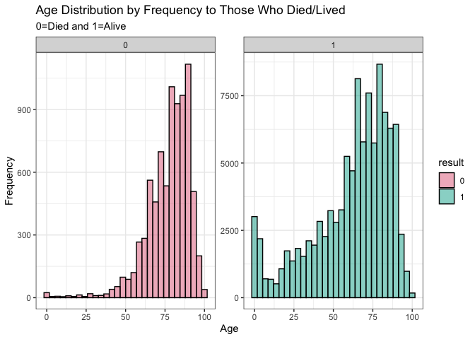
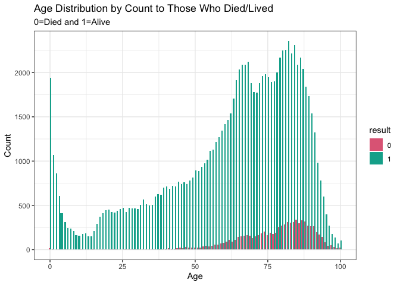
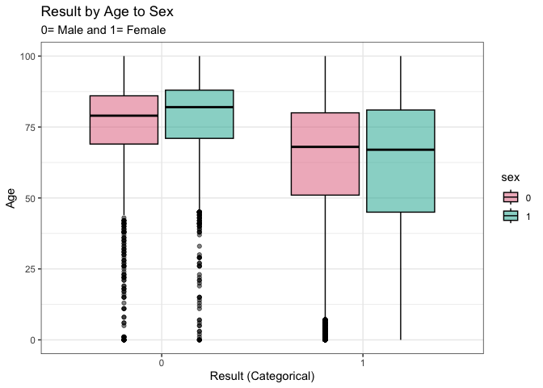

Sepsis Survival Classification via Naives Bayes
================
Rex Manglicmot

-   <a href="#status-continuing-working-document"
    id="toc-status-continuing-working-document">Status: Continuing Working
    Document</a>
-   <a href="#introduction" id="toc-introduction">Introduction</a>
-   <a href="#loading-the-libraries" id="toc-loading-the-libraries">Loading
    the Libraries</a>
-   <a href="#loading-the-data" id="toc-loading-the-data">Loading the
    Data</a>
-   <a href="#cleaning-the-data" id="toc-cleaning-the-data">Cleaning the
    Data</a>
-   <a href="#exploratory-data-analysis"
    id="toc-exploratory-data-analysis">Exploratory Data Analysis</a>
-   <a href="#naives-bayes" id="toc-naives-bayes">Naives Bayes</a>
    -   <a href="#applications" id="toc-applications">Applications</a>
    -   <a href="#pros" id="toc-pros">Pros</a>
    -   <a href="#cons" id="toc-cons">Cons</a>
-   <a href="#limitations" id="toc-limitations">Limitations</a>
-   <a href="#conclusion" id="toc-conclusion">Conclusion</a>
-   <a href="#appendix" id="toc-appendix">Appendix</a>
-   <a href="#inspiration-for-this-project"
    id="toc-inspiration-for-this-project">Inspiration for this project</a>

## Status: Continuing Working Document

Things still need to do/Questions:

-   Concepts on Naive Bayes + Cite Sources
-   color section for histogram
-   Flush out insights for the exhibits

## Introduction

<center>


</center>

According to the Center for Disease Control and Prevention, in a given
year, 1 of 3 patients who have died within the hospital had sepsis
during hospitalization, however, nearly 87% of sepsis cases starts
before the patient goes to the hospital.[^1] It leaves hospitals
institutions in a precarious situation. How do ultimately help a patient
get better and not be subjected to malpractice suits?

A special acknowledgement to the University of Irvine Data Repository
for providing this dataset.

The dataset contains 4 clinical features as follows:

-   age(int): years: integer
-   sex(binary): 0=male and 1=female
-   episode_number (int):
-   hospital_outcome(boolean): 0=dead and 1=alive

## Loading the Libraries

``` r
#install.packages('hrbrthemes') #installed on 12/18/22
#install.packages('ggthemes') #installed on 12/18/22
#install.packages('ggdark') #installed on 12/8/22
#install.packages('colorspace') #installed on 12/8/22

library(tidyverse)
library(ggthemes)
library(ggplot2)
library(viridis)
library(colorspace)
library(scales)
library(naivebayes)
library(ROCR)
```

## Loading the Data

``` r
#load the data
data_orig <- read.csv('Sepsis Survival.csv')

#view first 7 rows
head(data_orig, 7)
```

    ##   age_years sex_0male_1female episode_number hospital_outcome_1alive_0dead
    ## 1        21                 1              1                             1
    ## 2        20                 1              1                             1
    ## 3        21                 1              1                             1
    ## 4        77                 0              1                             1
    ## 5        72                 0              1                             1
    ## 6        83                 0              1                             1
    ## 7        74                 0              1                             1

## Cleaning the Data

``` r
#make a copy of the original dataset
data <- data_orig

#check for NA values
sum(is.na(data))
```

    ## [1] 0

``` r
#change colnames
colnames(data) <- c('age', 'sex', 'epi', 'result')

#check for all values
uni <- lapply(data, unique)
uni
```

    ## $age
    ##   [1]  21  20  77  72  83  74  69  53  82  75  45  56  46  48  40  39  70  47
    ##  [19]  27  11  91   7  79  84  16  73  17  18  63  88  89  76  41  66  80  62
    ##  [37]  59  55  68  33  71   8  58  78  51  43  44  60  86  61  67  57  81  49
    ##  [55]  64  25  65  42  36  38  85  24  19  37  35   6  50  87  54  29  12  10
    ##  [73]  23  52   9  15  31  92  28  30  13  94  90  26  32  95   5  93  34  96
    ##  [91]  22  97  98 100  14   4  99   3   2   1   0
    ## 
    ## $sex
    ## [1] 1 0
    ## 
    ## $epi
    ## [1] 1 2 3 4 5
    ## 
    ## $result
    ## [1] 1 0

``` r
#check classes for all columns
unlist(lapply(data, class))
```

    ##       age       sex       epi    result 
    ## "integer" "integer" "integer" "integer"

``` r
#change the sex, epi, and result columns 
data[,2:4] <- lapply(data[,2:4], as.factor)

#double check class but with a different function, sapply
sapply(data, class)
```

    ##       age       sex       epi    result 
    ## "integer"  "factor"  "factor"  "factor"

Let’s explore

## Exploratory Data Analysis

``` r
summary(data)
```

    ##       age         sex       epi       result    
    ##  Min.   :  0.00   0:57973   1:84811   0:  8105  
    ##  1st Qu.: 51.00   1:52231   2:16688   1:102099  
    ##  Median : 68.00             3: 5403             
    ##  Mean   : 62.74             4: 2199             
    ##  3rd Qu.: 81.00             5: 1103             
    ##  Max.   :100.00

We see a few interesting insights from the summary function:

1.  The mean is 62 and the median is 68 which means that Age as a
    symmetrical distribution.
2.  Male and Females are almost the same, with slightly more males.
3.  epi has more of the 1 category than the others. **Need to find more
    research about it and go back to the paper.**
4.  More people with sepsis lived than died within the confines of the
    hospital.

Let’s visually check out the dataset.

``` r
#create a histogram
ggplot(data, aes(x=age, fill= result)) +
  geom_histogram(alpha = .5, color = 'black') +
  facet_wrap(~result, scales= 'free_y') +
  scale_fill_discrete_qualitative() +
  theme_bw() +
  labs(title = 'Age Distribution by Those Who Died/Lived',
       subtitle = '0=Died and 1=Alive',
       y = 'Frequency',
       x = '')
```

<!-- -->

We see two interesting insights:

1.  Due to the facet wrap, we see that there are more people who lived
    than died.
2.  Based on the Age distribution, we see that both populations were
    majority in the elderly age group and thus are right skewed.

Let’s see how they both compare.

``` r
ggplot(data, aes(x=age, fill=result)) +
  geom_bar(position = 'dodge' ) +
  scale_fill_discrete_qualitative() +
  theme_bw()
```

<!-- -->

Visually, we see that there is big difference in terms of size. We see
that there is obviously more females in study than there were males
across all ages.

Let’s check out their density.

``` r
#create a density plot
ggplot(data, aes(x=age, fill= sex)) +
  geom_density(alpha = .5, color = 'black') +
  scale_fill_discrete_qualitative() +
  theme_bw()
```

<!-- -->

In terms of density, both male and females are overlapping and thus
similar.

``` r
#create a violin plot
ggplot(data, aes(x=epi, y=age, fill=sex)) +
  geom_violin(alpha = .5, color='black') +
  scale_fill_discrete_qualitative() +
  theme_bw()
```

<!-- -->

Insights:

-   We see across both sexes and episodes that majority of the patients
    were the age 60+. What this could possibly mean is that Sepsis is
    likely to be caused in older age brackets and an insight we can
    gather is that when an older patient that is admitted to the
    hospital it could signal to the nursing staff that said patient may
    likely have a sepsis and precautions could be taken in the nursing
    unit.

``` r
ggplot(data, aes(x=epi, fill=result)) +
  geom_bar(alpha = .5, color='black', position = 'dodge', width=0.5,
           show.legend = TRUE) +
  facet_wrap(~ epi, scales = 'free') +
  scale_fill_discrete_qualitative() +
  theme_bw()
```

<!-- -->

In terms of Episodes there are a number of insights:

-   In terms of sexes, there are clearly more females in all episodes.
    This insight was expected given the disproportionate rate of males
    to females
-   In terms of episodes, it is clear that most of the patients
    episodies were categorized majority in 1 and least in 5.

``` r
#create a boxplot
ggplot(data, aes(x=result, y=age, fill=sex)) +
  geom_boxplot(alpha = .5, color = 'black') +
  scale_fill_discrete_qualitative() +
  theme_bw()
```

<!-- -->

Insights:

-   In results, in those patients that died (0), we see that both male
    and females had outliers in the lower part of the box plot. Women
    age was slightly higher than males. \*In the results, in those
    patients that lived (1), we see that the females had a better
    distrivtuion than that of males.

``` r
#create a barchart
ggplot(data, aes(x=result, fill=sex)) +
  geom_bar(alpha = .5, color='black', width = 0.5) +
  scale_fill_discrete_qualitative() +
  theme_bw()
```

<!-- -->

``` r
#create a better  barchart
ggplot(data, aes(x=result, fill=sex)) +
  geom_bar(alpha = .5, color='black', width = 0.5) +
  facet_wrap(~ result, scales = 'free') +
  scale_fill_discrete_qualitative() +
  theme_bw()
```

<!-- -->

## Naives Bayes

<center>


</center>

Naive Bayes uses the Bayes theorem which states we can find the
probability of A given B.[^2]

<center>


</center>

### Applications

-   Sentiment Analysis. Identify positive and negative customer reviews.
-   Spam filtering. Identify spam emails.
-   Classify articles. Is the article, politics, healthcare, or oil &
    gas.

The assumption is A and B are independent.
</center>

### Pros

-   Quick and easy to implement
-   Useful for multiclass predictions as it is suited for categorical
    variables than numerical variables
-   No iterations
-   Requires small amount of training data and thus is NB is useful for
    small datasets.
-   When independent predictors assumptions are true, NB performs better
    than other models.

### Cons

-   Conditional independence assumption is not always true as there are
    cases where features are dependent on each other.
-   Zero frequency problem, which is when a category variable is present
    in the test data set and not in the train dataset, the model will
    make a 0 probability.

``` r
#set seed to have reproducible results
set.seed(123)

#split data into a 70/30 split
ind <- sample(2, nrow(data), replace = T, prob = c(0.7, 0.3))

#split test and train
train <- data[ind==1, ]
test <- data[ind==2, ]

#build model
model <- naive_bayes(result~., data=train)
```

``` r
#for numeric intergers we can get mean and sd for dead
train %>%
  dplyr::filter(result =='0') %>%
  summarise(mean(age), sd(age))
```

    ##   mean(age)  sd(age)
    ## 1  77.15803 13.92635

``` r
#for numeric intergers we can get mean and sd for alive
train %>%
  dplyr::filter(result =='1') %>%
  summarise(mean(age), sd(age))
```

    ##   mean(age) sd(age)
    ## 1  61.68295 24.3987

``` r
#Predict
p <- predict(model, train, type = 'prob')
head(cbind(p, train))
```

    ##               0         1 age sex epi result
    ## 1  0.0001442743 0.9998557  21   1   1      1
    ## 3  0.0001442743 0.9998557  21   1   1      1
    ## 6  0.1633923481 0.8366077  83   0   1      1
    ## 7  0.1388140530 0.8611859  74   0   1      1
    ## 9  0.1136993430 0.8863007  69   0   1      1
    ## 10 0.0280715088 0.9719285  53   1   1      1

``` r
#store prediction in an object
predict1 <- predict(model, train)

#create a confusion matrix
CM1 <- table(predicted = predict1, actual = train$result)

print(CM1)
```

    ##          actual
    ## predicted     0     1
    ##         0     0     0
    ##         1  5676 71551

``` r
train %>%
  summarize(accuracy = mean(result == 1))
```

    ##    accuracy
    ## 1 0.9265024

``` r
train %>%
  summarize(accuracy = mean(result == 0))
```

    ##     accuracy
    ## 1 0.07349761

Let’s look diagonally:

-   0 patients were correctly predicted as classified as Dead (result =
    0)
-   71551 patients were correctly predicted as classified as Alive
    (result = 1).

``` r
#calculate miscalculation error
1-sum(diag(CM1))/sum(CM1)
```

    ## [1] 0.07349761

Misclassifications are about 7%.

Let’s repeat for test set

``` r
#store prediction in an object
predict2 <- predict(model, test)

#create a confusion matrix
CM2 <- table(predicted = predict2, actual = test$result)

print(CM2)
```

    ##          actual
    ## predicted     0     1
    ##         0     0     0
    ##         1  2429 30548

``` r
test %>%
  summarize(accuracy = mean(result == 1))
```

    ##    accuracy
    ## 1 0.9263426

``` r
test %>%
  summarize(accuracy = mean(result == 0))
```

    ##    accuracy
    ## 1 0.0736574

Let’s look diagonally:

-   0 patients were correctly predicted as classified as Dead (result =
    0).
-   30548 patients were correctly predicted as classified as Alive
    (result = 1).

``` r
#calculate miscalculation error
1-sum(diag(CM2))/sum(CM2)
```

    ## [1] 0.0736574

Misclassifications are about 7%.

## Limitations

One limitation is that although both miscalculation errors for the train
and test dataset are low, about 7%, the model failed to predict
accurately those who died within the hospital in both datasets. In fact,
it the model got it all wrong! This can be due to prevalence; there is
more 1 (Alive) than there is 0 (Dead) within the dataset.

If our dataset in our train is biased then our results in out test will
be biased as well.

## Conclusion

## Appendix

``` r
#plot the model
plot(model)
```

<!-- --><!-- --><!-- -->

## Inspiration for this project

[^1]: <https://www.cdc.gov/sepsis/what-is-sepsis.html#>:\~:text=In%20a%20typical%20year%3A,had%20sepsis%20during%20that%20hospitalization

[^2]: <https://towardsdatascience.com/naive-bayes-classifier-81d512f50a7c>
